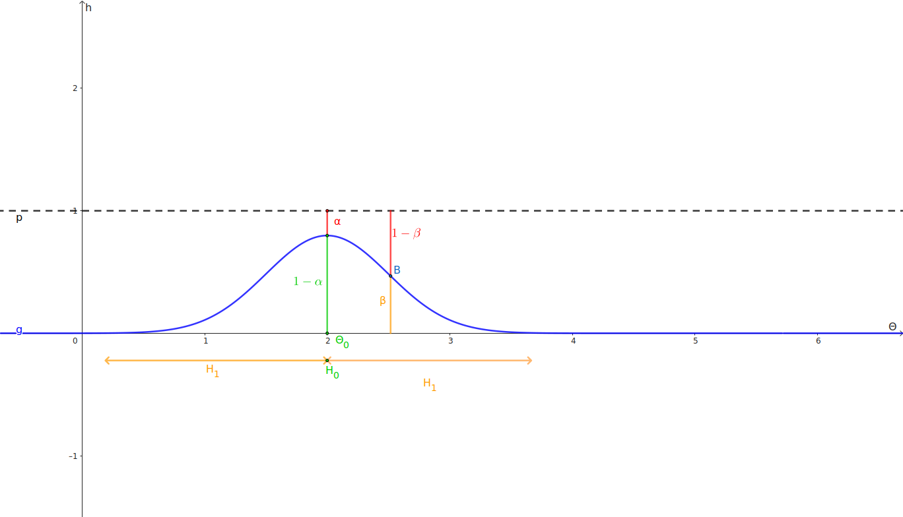

# Test statistici
Son procedure progettate di *inferenza statistica* per decidere tra due ipotesi in presenza di informazioni parziali o di casualità, in modo tale da tenere sotto controllo le probabilità di errore. L'inferenza statistica è quella branca della statistica che si preoccupa di inferire i parametri di una [[distribuzione]] a partire da dati appartenenti a quella [[distribuzione]] già visti.

Abbiamo un campione di dati, e applicandoci sopra il test statistico, possiamo dire o $H_0$ (*l'innocenza* o ipotesi di base: non c'è nulla di strano) o $H_1$ (detta anche $H_a$ per *ipotesi alternativa* e rappresenta *la colpevolezza*: c'è qualcosa di strano). Esigiamo che ci siano prove precise che ci dicano $H_1$, mentre per quanto riguarda $H_0$ saremo più laschi. In altre parole, il test ci dice $H_1$ quando siamo sicuri di $H_1$, dice $H_0$ in tutti gli altri casi.

Quando il test dice $H_0$, allora l'unica cosa che possiamo conlcudere è che non ci sono prove schiaccianti per dire $H_1$. La filosofia è **innocenza fino a prova contraria**.

Tipicamente quello che voglio dimostrare deve stare in $H_1$. Si noti che un test con pochi dati dirà quasi sempre $H_0$.

Alcuni esempi:
- in una situazione indistriale o di controllo qualità $H_0$ (**chiamato AQL**, Acceptable Quality Level) è dire che va tutto bene mentre $H_1$ è dire che c'è qualcosa di strano (**chiamato UQL**, Unacceptable Quality Level).
- in una ricerca farmacologica $H_0$ è *il faramco fa male*, $H_1$ è *il farmaco funziona*.

Un test statistico coinvolge diverse grandezze, fra cui citiamo:
- **ipotesi $H_0$ o $H_1$**
- **parametro $\Theta$ e un valore $\Theta_0$** su cui testare le nostre affermazioni
- **parametro campionario $\bar \Theta$**: calcolato dai dati ricevuti e stima il parametro della [[distribuzione]] reale $\Theta$
- **livello di significatività $\alpha$**: una probabilità che rappresenta quanto al massimo vogliamo ottenere distanziarci dalla stima di $\Theta$ senza essere costretti a dire *colpevolezza* ($H_1$)
- **livello di confidenza $1 - \alpha$**: rappresenta quanto siamo sicuri che il test sia significativo.  Nota: ponendo il controllo su $\alpha$, andiamo a porre un controllo anche sulla confidenza del mio test
- **intervalli di confidenza**: un intervallo nel quale se $\bar \Theta$ ne ricade all'interno allora possiamo affermare, con un livello di confidenza $\alpha$ fissato a priori, $H_0$ (o alternativamente $H_1$ se $\bar \Theta \not \in \mathrm{IC}$ con $\mathrm{IC}$ l'intervallo di confidenza). Nota: $\mathrm{IC}$ dipende da $\alpha$ in qualche modo (che poi vedremo)
- **statistica del test**: la [[funzione-ancillare|funzione ancillare]] calcolata nel punto $\Theta = \Theta_0$

## Errori del test
Quando si compiono delle deduzioni statistiche, è possibile tipicamente incappare in due tipologie di errori:
- **errore di prima specie**: dire $H_1$ quando è vera $H_0$, considerato il più grave. Ha una probabilità $\alpha$ di realizzarsi
- **errore di seconda specie**: dire $H_0$ quando è vera $H_1$, considerato il più grave. Ha una probabilità $\beta$ di realizzarsi

Di solito si costruiscono i test in modo tale che l'errore di prima specie $\alpha$ sia sicuramente minore o uguale al **livello di significatività** $\bar \alpha$, quindi in modo tale che
$$
\alpha \le \bar \alpha
$$

Per quanto riguarda la procedura dei test statistici presi in esame qua, non esiste l'analogo controllo, che tipicamente si richiede ad $\alpha$, su $\beta$.

Quando si compiono dei test, bisogna decidere il parametro di una [[distribuzione]] da testare e le affermazioni $H_0$ e $H_1$ coinvolgeranno questo parametro. D'ora in avanti indicheremo questo parametro con $\Theta$. Le ipotesi possono essere di due tipi: **unilaterali** o **bilaterali**. Nel primo caso, queste corrispondono a ipotesi $H_0$ del tipo $\Theta = \bar \Theta$ con $\bar \Theta$ il parametro che si evince dai dati ottenuti; in $H_1$ metteremo la disuguaglianza ($\Theta \not = \bar \Theta$), questo perchè scambiare le ipotesi rende le cose tipicamente molto più complicate.Nei test unilaterali invece si usano espressioni come $\Theta \lesseqgtr \bar \Theta$, tuttavia è responsabilità di chi progetta il test scegliere quale usare. In ogni caso, se l'ipotesi nulla non presenta anche uguaglianza, allora sarà l'ipotesi alternativa a doverla presentare e viceversa; per convenzione in genere il simbolo di uguale si mette in $H_0$.

## Funzionamento di un test statistico
0) Si deve avere un *campione* della *popolazione totale* (ovvero un piccolo insieme di dati che provengono ad un più grande insieme di dati) di cui è nota la [[distribuzione]] (ad esempio $X_i \sim \mathcal{N}(\mu, \sigma^2)$ per $i = 1, \ldots, n$).
1) Si deve scegliere un parametro $\Theta$ su cui fare il test (ad esempio, se volessimo vedere se il campione gaussiano di cui sopra ha un certa media $\mu$, sceglieremmo $\Theta = \mu$).
2) Si devono scrivere le ipotesi (ad esempio $H_0: \mu = \mu_0$ e $H_1: \mu \not = \mu_0$ con $\mu_0 = 2$).
3) Si identifica (da una lista già creata) lo [[inferenza-statistica|stimatore]] $\bar \Theta$ del paramentro $\Theta$ e come si distribuisce (nell'esempio che stiamo facendo sarà $\bar X \sim \mathcal{N}(\mu, \frac{\sigma^2}{n})$)
4) Si identifica la sua [[funzione-ancillare|funzione ancillare]] $\Omega$ (nel nostro caso $\frac{\bar X - \mu}{S / \sqrt{n}} \sim t(n-1)$)
5) Si calcola la *statistica del test* $T$, ovvero il valore della [[funzione-ancillare|funzione ancillare]] $\Omega$ nel punto $\Theta = \Theta_0$. Si noti che questa operazione equivale a supporre vera $H_0$, vedremo nelle fasi successive come questo tornerà utile (nel nostro caso, se $H_0: \mu = \mu_0$ allora $T := \frac{\bar X - \mu_0}{S / \sqrt{n}} \stackrel{H_0}{\sim} t(n-1)$). Si noti che la [[distribuzione]] della [[funzione-ancillare|funzione ancillare]] esiste anche al di fuori dell'ipotesi $H_0$, tuttavia risulta molto più complicata e questa scelta rende il test molto più semplice.
6) Si calcola la *regione di accettazione* $\mathrm{RA}_T$ della statistica del test $T$ per un fissato livello di significatività $\alpha$. In questa fase avviene il controllo sull'errore di prima specie, infatti si pone $\alpha = P(\text{dire } H_1 | \text{vera } H_0) = P(T \not \in \mathrm{RA}_T | T \sim \Omega) = \bar \alpha$ (nell'esempio, preso $q = F^{-1}_{t(n - 1)}(1 - \frac{\alpha}{2})$ allora $P(\frac{\bar X - \mu_0}{S / \sqrt{n}} \not \in [-q, q] | T \sim \Omega) = \alpha$)
7) Se $T \in \mathrm{RA}_T$ allora dico $H_0$, altrimenti dirò $H_1$.
### Il p-value
Si noti che questo non è l'unico modo di fare i test. Sarebbe possibile saltare i passaggi 6 e 7 calcolando il *p-value* $\alpha^* = 1 - F_\Omega(T)$ (chiamato anche *p-dei-dati*) che è **la probabilità di vedere i dati ancora più strani rispetto a quelli ottenuti**, con $F_\Omega$ la [[variabili-aleatorie#Continue|CdF]] della [[funzione-ancillare|funzione ancillare]] $\Omega$ e $T$ la statistica del test. Se il p-value è inferiore al livello di significatività allora dire $H_1$, ovvero $\alpha^* < \bar \alpha \implies H_1$.

Nota: non è detto che la [[funzione-ancillare|funzione ancillare]] e/o la statistica del test esistano.

Tipicamente, una volta ottenute la statistica del test e la $\mathrm{RA}_T$ posso già calcolare $H_0$, $H_1$, $\alpha^*$, la curva OC, la potenza del test e $\beta$.

## Curva operativa caratteristica (OC)
Serve per valutare le performarnce di un test, ed è definita come $h(\Theta) = P(\text{dire } H_0 | \Theta) = P(T \in \mathrm{RA}_T | \Theta): \mathbb{R} \to [0, 1]$, ovvero la probabilità che il test dica $H_0$ al variare di $\Theta$. Per plottare questa curva, basta utilizzare la statistica del test $T$ e farla variare in base ad un $\Theta$ e calcolarne la probabilità (come se si dovesse fare il plot di una funzione $y(x)$ al variare di $x$). 

Nei casi bilaterali la forma di $h$ è a campana (ma non è simile ad una gaussiana, è più schiacciata verso l'alto); inoltre ci sarà un solo punto nel grafico in cui $\Theta = \Theta_0$. Il punto $(\Theta_0, h(\Theta_0))$ è il punto massimo della curva e nel quale possiamo vedere che $1 - h(\Theta_0) = \alpha$ è l'errore di prima specie. Si  noti che in tutti gli altri punti che non sono $\Theta_0$ sappiamo essere vera $H_1$, quindi in ciasuno di quei punti sotto la curva possiamo commettere un errore di seconda specie $\beta$. In questo caso solo $\beta$ è una funzione, $\alpha$ no.

Nei testi unilaterali ha questa forma (dove in questo caso abbiamo posto $H_0: \Theta \le \Theta_0$, altrimenti se fosse in contrario avremmo la curva specchiata):

In questo caso $H_0$ è un range di valori e non uno singolo come nel caso bilaterale e avremo che dopo $\Theta = \Theta_0$ (nel grafico $p_0$) i valori di $\Theta$ saranno inaccettabili.

### Come varia il grafico in base al cambiamento dei parametri?
- Se riduciamo il livello di significatività $\bar \alpha$ del test allora la curva tenderà a salire (nel tentativo di ridurre $\alpha$), senza cambiare troppo la pendenza (intuitivamente è come se l'area sotto il suo grafico aumenti, questo comporta anche l'aumento di $\beta$, per cui rischiamo di dire più spesso $H_0$ quando vera $H_1$). Il test commetterà meno spesso l'errore di prima specie, ma commetterà più spesso quello di seconda specie.
- Se aumentiamo la numerosità (che spesso costa) del campione, allora riusciamo a modificare la pendenza del test, rendendo più alte le zone alte e più basse le zone basse. Il test in questo modo migliora in ogni punto. Si noti che se la numerosità fosse pari alla grandezza della popolazione, allora la curva OC sarebbe simile alla funzione di Heaviside.
- Se spostiamo $\Theta_0$ allora la curva si trasla.
## Potenza del test
La potenza è $P(\text{dire } H_1 | \text{vera } H_1) = 1 - h(\Theta_p)$ in un punto specificato $\Theta_p$. La potenza del test ci indica la capacità che ha il test di rilevare (in percentuale) un problema in un determinato punto.

Nella terminologia industriale si usano anche altri due termini:
- **AQL** (Acceptable Quality Level): valore decisamente buono del parametro, la probabilità che il test rilevi erroneamente qualcosa non va oltre il $\alpha \le \bar \alpha$. Terminologia utile per tenere sotto controllo l'errore di prima specie. Tipicamente l'AQL è $\Theta_0$.
- **UQL** (Unacceptable Quality Level): valore decisamente cattivo del parametro, la probabilità che il test rilevi erroneamente che va tutto bene è $\beta \le \bar \beta$. Generalmente è qui che si dovrebbe misurare la potenza del test per verificarne le capacità. Terminologia che serve per tenere sotto controllo l'errore di seconda specie. Nel grafico (unilaterale) di cui sopra corrisponde a $p_1$.

Il test discrima bene per $\Theta \le \mathrm{AQL}$ e per $\Theta \ge \mathrm{UQL}$, mentre è poco affidabile per $\Theta \in [\mathrm{AQL}, \mathrm{UQL}]$ (ovvero dirà $H_1$ o $H_0$ senza precisione alta).

## Determinare la numerosità
Una delle domande più frequenti dell'industria è qual è il minimo $n$ per cui riesco ad avere un test affidabile?
Nei test classici ci sono 5 parametri fondamentali:
- $\Theta_0$: l'AQL
- $\bar \alpha$: il livello di significatività
- $n$: la numerosità
- $\Theta_1$: il UQL
- $\bar \beta$: per tenere sotto controllo l'errore di seconda specie

L'idea è che la curva $h$ passi sopra il punto $(\Theta_0, 1 - \bar \alpha)$ ma passi sotto $(\Theta_1, 1 - \bar \beta)$ così da riuscire a determinare $n$.
C'è un legame per il quale avendo $4$ di questi se ne determina un quinto.

## Intervalli di confidenza
Sono degli intervalli del parametro che ci interessa, in modo tale che se il parametro non ricade nell'intervallo considerato, allora dobbiamo rifiutare una determinata ipotesi. Si noti che per calcolarli è necessaria una [[funzione-ancillare|funzione ancillare]] (perchè bisogna ottenere dei quantili; nel caso in cui la [[funzione-ancillare|funzione ancillare]] non sia presente, bisogna sperare in qualche approssimazione della [[distribuzione]] dello [[inferenza-statistica|stimatore]]). 
In terminologia industriale si direbbe che è l'insieme dei valori del parametro che, se presi come AQL, portano a concludere $H_0$.
Si noti che si ottengono sempre a partire da $\alpha = P(\text{dire } H_1 | \text{vera } H_0)$ però, invece di cercare di ottenere il valore del parametro, cerco di ottenere il valore del mio [[inferenza-statistica|stimatore]], tenendolo come incognita.

## Intervalli di predizione
Gli intervalli di predizione sono utili nella casistica in cui si cerca di prevedere un possibile punto futuro $X_{n+1}$ dati i punti precedenti $X_n$.
Nota: intuitivamente questo è possibile perchè andiamo a stimare i parametri della [[distribuzione]] soggiacente gli $n$ punti già visti, così da ottenere, con una certa confidenza, la risposta a dati non visti.
In questo contesto si usano diverse tecniche, e al momento ne abbiamo viste poche, tuttavia possiamo portare un esempio:
Caso tipico di base, $X_1, \ldots, X_n \sim \mathcal{N}(\mu, \sigma^2)$ [[indipendenza#Indipendenti e identicamente distribuite|i.i.d.]] con $\mu$ e $\sigma$ incognite. Vorremmo prevedere il punto $X_{n+1}$. Sappiamo che $X_{n+1} \approx \bar X = \frac{1}{n} \sum_{i = 1}^n X_i \sim \mathcal{N}(\mu, \frac{\sigma^2}{n})$. Ora si noti che $E(X_{n+1} - \bar X) = 0$ e che $Var(X_{n+1} - \bar X) = Var(X_{n+1}) + Var(\bar X) = \sigma^2 + \frac{\sigma^2}{n} = \sigma^2(1+\frac{1}{n})$.
Quindi $X_{n+1} - \bar X \sim \mathcal{N}(0, \sigma^2(1+\frac{1}{n}))$. Dato che siamo in caso gaussiamo, univariato, sappiamo che $\frac{X_{n + 1} - \bar X}{\sigma \sqrt{1 + 1/n}} \sim \mathcal{N}(0, 1)$ sono statistica del test e [[funzione-ancillare|funzione ancillare]], tuttavia sappiamo per ipotesi che $\sigma$ è incognita, per cui possiamo approssimare usando $\frac{X_{n + 1} - \bar X}{S_X \sqrt{1 + 1/n}} \sim t(n-1)$ con $S_X$ la varianza campionaria. Dall'espressione $\Big| \frac{X_{n + 1} - \bar X}{S_X \sqrt{1 + 1/n}}\Big|  \le F_{t(n-1)}(1-\frac{\alpha}{2}))$ ricaviamo l'intervallo di predizione.
Nota: come forse è intuitivo, l'intervallo di predizione per $X_{n + 1}$ è (molto) più largo dell'intervallo di confidenza per la stima di $\mu$, ma non bisogna farsi confondere perchè l'uso che se ne fa e il significato che questi due intervalli hanno è molto differente.
