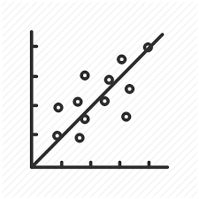

# 📋 Appunti del corso di Statistica Industriale
Il corso di Statistica Industriale (o Introduzione al Machine Learning) è stato erogato dal professor Francesco Morandin all'Università degli studi di Parma (UNIPR) nell'A.A. 2021-2022. Questi sono gli appunti che raccolti durante tale anno accademico.

Assieme agli appunti, talvolta, sarà possibile trovare dei comandi da utilizare su Excel, poichè parte integrante del corso è il laboratorio.

## 🛠 Visualizzazione
Appunti scritti grazie a [Foam](https://foambubble.github.io).
Sono necessari VSCode e la sua estensione.
È possibile visualizzare un grafo della conoscenza lanciando il comando `Foam: Show Graph` da VSCode.

## 📜 Breve Introduzione
La statistica nasce nel 1600 come *descrittiva*, in cui si hanno i dati completi su tutta la popolazione in esame (come può capitare ad enti come [istat](https://www.istat.it/) e [eurostat](https://ec.europa.eu/info/index_it)), ma senza utilizzare la probabilità.

Successivamente intorno agli anni '30, grazie a Fisher, nasce la statistica *inferenziale*, e, grazie all'uso della probabilità, si possono fare affermazioni sull'intera popolazione a partire da un campione ridotto.

Negli anni '60 Deming in giappone introduce il concetto di qualità all'interno di Toyota e negli anni '80 Motorola con la *six sigma statistics*
